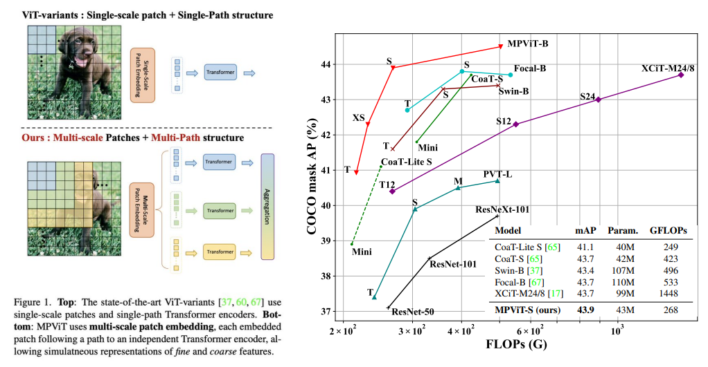

## CVPR 22

Implement as many papers as possible from CVPR 2022 (Conference on Computer Vision and Pattern Recognition
)

## Papers
### Mip-NeRF 360: Unbounded Anti-Aliased Neural Radiance Fields
- Presentation: https://youtu.be/zBSH-k9GbV4
- Paper URL: https://arxiv.org/abs/2111.12077
- Twitter thread: https://twitter.com/i/status/1499185104035344384

Though neural radiance fields (NeRF) have demonstrated impressive view synthesis results on objects and
small bounded regions of space, they struggle on “unbounded” scenes, where the camera may point in any direction and content may exist at any distance. In this setting, existing NeRF-like models often produce blurry or
low-resolution renderings (due to the unbalanced detail and
scale of nearby and distant objects), are slow to train, and
may exhibit artifacts due to the inherent ambiguity of the
task of reconstructing a large scene from a small set of
images. We present an extension of mip-NeRF (a NeRF
variant that addresses sampling and aliasing) that uses a
non-linear scene parameterization, online distillation, and
a novel distortion-based regularizer to overcome the challenges presented by unbounded scenes. Our model, which
we dub “mip-NeRF 360” as we target scenes in which the
camera rotates 360 degrees around a point, reduces meansquared error by 54% compared to mip-NeRF, and is able to
produce realistic synthesized views and detailed depth maps
for highly intricate, unbounded real-world scenes.

### BANMo: Building Animatable 3D Neural Models from Many Casual Videos
- Project page: https://banmo-www.github.io/
- Paper URL: https://arxiv.org/abs/2112.12761

Prior work for articulated 3D shape reconstruction often relies on specialized sensors (e.g., synchronized multi-camera systems), or pre-built 3D deformable models (e.g., SMAL or SMPL). Such methods are not able to scale to diverse sets of objects in the wild. We present BANMo, a method that requires neither a specialized sensor nor a pre-defined template shape. BANMo builds high-fidelity, articulated 3D models (including shape and animatable skinning weights) from many monocular casual videos in a differentiable rendering framework. While the use of many videos provides more coverage of camera views and object articulations, they introduce significant challenges in establishing correspondence across scenes with different backgrounds, illumination conditions, etc. Our key insight is to merge three schools of thought; (1) classic deformable shape models that make use of articulated bones and blend skinning, (2) volumetric neural radiance fields (NeRFs) that are amenable to gradient-based optimization, and (3) canonical embeddings that generate correspondences between pixels and an articulated model. We introduce neural blend skinning models that allow for differentiable and invertible articulated deformations. When combined with canonical embeddings, such models allow us to establish dense correspondences across videos that can be self-supervised with cycle consistency. On real and synthetic datasets, BANMo shows higher-fidelity 3D reconstructions than prior works for humans and animals, with the ability to render realistic images from novel viewpoints and poses.

### MPViT: Multi-Path Vision Transformer for Dense Prediction
- Paper URL: https://arxiv.org/abs/2112.11010

Dense computer vision tasks such as object detection and segmentation require effective multi-scale feature representation for detecting or classifying objects or regions with varying sizes. While Convolutional Neural Networks (CNNs) have been the dominant architectures for such tasks, recently introduced Vision Transformers (ViTs) aim to replace them as a backbone. Similar to CNNs, ViTs build a simple multi-stage structure (i.e., fine-to-coarse) for multi-scale representation with single-scale patches. In this work, with a different perspective from existing Transformers, we explore multi-scale patch embedding and multi-path structure, constructing the Multi-Path Vision Transformer (MPViT). MPViT embeds features of the same size~(i.e., sequence length) with patches of different scales simultaneously by using overlapping convolutional patch embedding. Tokens of different scales are then independently fed into the Transformer encoders via multiple paths and the resulting features are aggregated, enabling both fine and coarse feature representations at the same feature level. Thanks to the diverse, multi-scale feature representations, our MPViTs scaling from tiny~(5M) to base~(73M) consistently achieve superior performance over state-of-the-art Vision Transformers on ImageNet classification, object detection, instance segmentation, and semantic segmentation. These extensive results demonstrate that MPViT can serve as a versatile backbone network for various vision tasks

