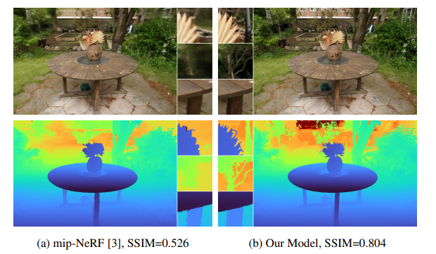

## CVPR 22

Implement as many papers as possible from CVPR 2022 (Conference on Computer Vision and Pattern Recognition
)

## Papers
### Mip-NeRF 360: Unbounded Anti-Aliased Neural Radiance Fields
- Presentation: https://youtu.be/zBSH-k9GbV4
- Paper URL: https://arxiv.org/abs/2111.12077
- Twitter thread: https://twitter.com/i/status/1499185104035344384

Abstract
Though neural radiance fields (NeRF) have demonstrated impressive view synthesis results on objects and
small bounded regions of space, they struggle on “unbounded” scenes, where the camera may point in any direction and content may exist at any distance. In this setting, existing NeRF-like models often produce blurry or
low-resolution renderings (due to the unbalanced detail and
scale of nearby and distant objects), are slow to train, and
may exhibit artifacts due to the inherent ambiguity of the
task of reconstructing a large scene from a small set of
images. We present an extension of mip-NeRF (a NeRF
variant that addresses sampling and aliasing) that uses a
non-linear scene parameterization, online distillation, and
a novel distortion-based regularizer to overcome the challenges presented by unbounded scenes. Our model, which
we dub “mip-NeRF 360” as we target scenes in which the
camera rotates 360 degrees around a point, reduces meansquared error by 54% compared to mip-NeRF, and is able to
produce realistic synthesized views and detailed depth maps
for highly intricate, unbounded real-world scenes.

